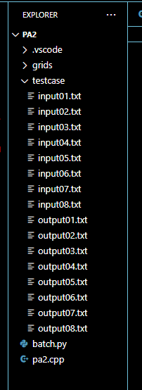
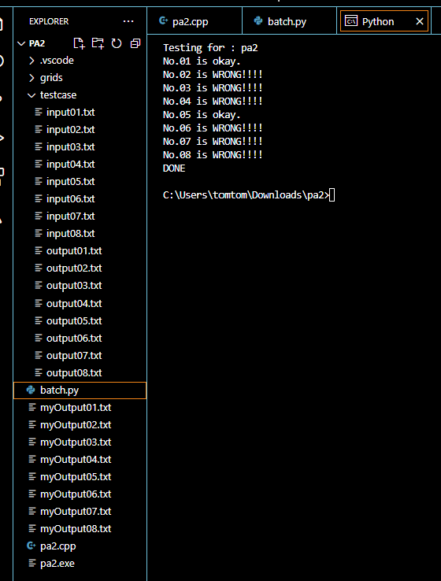

# Run the testcases automatically for c++

Feel tired of typing "pa1 < testcase/input01.txt > myOutput01.txt" again and again? Use this simple python program to do it automatically!
Basically for hkust students taking comp c++ courses (I don't know how other school are doing XD)

## How to use?
- Put the 'batch.py' into the same folder of your main c++ program
- Put the testcases into a folder named "testcase"

The path of your main program may be "your_folder_name/pa1.cpp"

The path of the testcases may be "your_folder_name/testcase/input01.txt"

For example :

#

Run the "batch.py"!

You can see that "myOutput01.txt" to "myOutput08.txt" are generated!!

(Ignore my typo in the picture, it is fine in the program)

- You can change the number of testcases you want to generate. Just change the number in the patch.py

- If you change num to 8, it equals to generate "myOutputXX.txt" from 01 to 08. [remember that it is not start from 0 XD]
